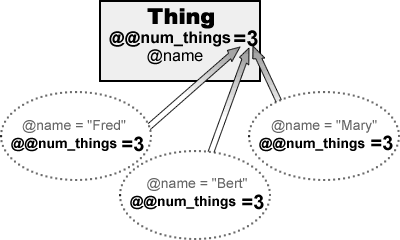

---

	{
		"title": "第二章",
		"ctime": "2016-11-06 21:30:00",
		"mtime": "2016-11-06 21:30:00"
	}

---

# 第二章

***

## 类的层次结构、属性与变量

在上一节结束时我们创建两个类：Thing 和 Treasure，尽管事实上这两个类共享了一些功能（特别是两者都包含 'name'），但它们是没有联系的。

现在，这两个类的重复看起来是不值一提的。但是，当你开始写一些复杂的程序时，你的类将会包含大量的变量和方法；你真的想将同样的事情一遍又一遍的重复吗。

对于其中一个类是其它（祖先）类的特殊类型结构来说创建一个类层次是更有意义的，这种情况下它会自动继承（inherit）祖先类的特征。例如，在我们简单的冒险游戏中，Treasure 是 Thing 的一个特殊的类型，因此 Treasure 就会继承 Thing 类的特征。

	<b>类层次——祖先（Ancestors）和后代（Descendants）：</b>在这本书中，我会经常提及“后代”类继承（inherit）自它们祖先类，这些术语意味着“相关”类之间的一种类似于家庭的关系。Ruby 中每一个类只有一个父亲，然而，它可能在一个很长很大的家庭树中，有许多代的父母、祖父母等等...

Thing 类的特征通常被定义在它内部，Treasure 类则会自动地“继承” Thing 类所有的的特性。所以，我们不需要再次对这些特征进行编码，而是额外添加一些 Treasures 类特有的特性。

通常地规则是，在创建类层次结构时，具有更多通用特征的类要比具有更多特殊特征的类层次更高一些。所以，只有一个 *name* 和 *description* 的 Thing 类是具有 *name*、*description* 以及 *value* 的 Treasure 类的祖先；Thing 类也可能是一些其它的特殊类的祖先，例如具有 *name*、*description* 以及 *exits* 的 Room 类。

	<dl>
		<dt><strong>一个父亲，有多个孩子...</strong></dt>
		<dd>
			

				
			

			Thing 类具有 <i>name</i> 和 <i>description</i> （在 Ruby 程序中，它们可能是内部变量 <code>@name</code> 和 <code>@description</code>）。Treasure 和 Room 类都派生自 Thing 类，所以它们自动地继承了 <i>name</i> 和 <i>description</i> 。Treasure 类添加了一个 <i>value</i>，所以它就具有 <i>name</i>、<i>description</i> 和 <i>value</i> ；Room 类添加了一个 <i>exits</i>，所以它就具有 <i>name</i>、<i>description</i> 和 <i>exits</i> 。
		</dd>
	</dl>

1adventure.rb

来让我们看看如何在 Ruby 中创建一个后代类。加载 **1adventure.rb** 程序，这只需要定义一个具有两个实例变量（instance variables）`@name` 和 `@description` 的 Thing 类，它们的值可以在创建新的 Thing 对象时在 `initialize` 方法中赋值。

实例变量通常不能（也不应该）被外部直接访问，这是为了遵循上一章讲到的封装（ encapsulation）原则。为了获得我们所需要的每个变量的值，我们需要一个 get 访问器方法，例如 `get_name`；为了给某个变量赋一个新值，我们也需要一个 set 访问器方法，例如 `set_name`。

### 超类与子类

现在来看看 Treasure 类，注意声明方式：

	class Treasure < Thing

尖括号 `<` 表示 Treasure 是 Thing 的一个子类（后代类），因此它从 Thing 类继承数据（变量）和行为（方法）。因为 `get_name`、`set_name`、`get_description` 以及 `set_description` 方法已经存在于 Thing 类中，所以不需要在后代类（Treasure）中再编写了。

Treasure 类还有额外的数据，也就是它的 value（`@value`），我已经为它编写了 *get* 和 *set* 访问器了。当创建一个新的 Treasure 对象时，它的 `initialize` 方法会被自动调用。一个 Treasure 对象有三个变量（`@name`、`@description` 和 `@value`）需要初始化，所以它的 `initialize` 方法有三个参数。前两个参数使用 `super` 关键字传递给超类（Thing）的 `initialize` 方法，以便 Thing 类的 `initialize` 方法可以处理它们：

	super(aName, aDescription)

当在方法中使用时，`super` 关键字调用在祖先类或超类中的与当前所在方法的同名方法。如果 `super` 关键字没有指定任何参数，当前方法的所有参数将会传递给祖先类的方法。但是，像本例中一样，提供了一个特定的参数列表时（这里是 `aName` 和 `aDescription`），那么只有这些参数会被传递给祖先类的方法。

### 向超类传递参数

当调用超类的方法时，括号是很重要的！如果参数列表为空，并且没有使用括号，那么所有的参数都将传递给超类。但是，参数列表为空，并且使用了括号时，将不会给超类传递任何参数。

super_args.rb

	# This passes a, b, c to the superclass
	def initialize(a, b, c, d, e, f)
	  super(a, b, c)
	end

	# This passes a, b, c to the superclass
	def initialize(a, b, c)
	  super
	end

	# This passes no arguments to the superclass
	def initialize(a, b, c)
	  super()
	end

	要更好的了解 <code>super</code> 关键字的使用，请参阅本章末尾的<b>深入探索</b>部分。

### 访问器方法

虽然这些类在冒险游戏中运行的足够好，但它们仍然是累赘的，因为设置了大量的 *get* 和 *set* 访问器方法。让我们看看有什么补救措施。

替换掉 `@description` 实例变量的两个不同的方法，`get_description` 和 `set_description`。

	puts(t1.get_description)
	t1.set_description("Some description")

取值和赋值也许更好一些，对于一个简单的变量使用下面的方式进行取值和赋值：

	puts(t1.description)
	t1.description = "Some description"

为了能够做到这一点，我们需要修改 Treasure 类的定义。实现这一点的方法是重写 `@description` 的访问器方法：

	def description
	  return @description
	end

	def description=(aDescription)
	  @description = aDescription
	end

accessors1.rb

我已经在 **accessors1.rb** 中添加了类似于上面的访问器。*get* 访问器被称为 `description`，*set* 访问器被称为 `description=`（即就是，将等号（=）附加到 *get* 访问器方法名后面）。现在，就可以将一个新的字符串进行赋值了：

	t.description = "a bit faded and worn around the edges"

你可以像这样取值：

	puts(t.description)

### 'Set' 访问器

当你想要以这种方式编写 set 访问器时，必须将 `=` 字符附加到方法名后面，而不仅仅是将其放置于方法名和参数之间。

所以，这样是正确的：

	def name=(aName)

但这样是错误的：

	def name = (aName)

### 属性的读与写

事实上，有一个更简单的方式实现相同的功能。所有你要做的就是使用两个特殊的方法，`attr_reader` 和 `attr_writer`，后跟一个符号（symbol）：

	attr_reader :description
	attr_writer :description

你可以添加这些代码到你的类定义中：

	class Thing
	  attr_reader :description
	  attr_writer :description
		# maybe some more methods here…
	end

使用一个符号并调用 `attr_reader` 方法将会为命名与该符号（`:description`）相匹配的实例变量（`@description`）创建一个 *get* 访问器。

调用 `attr_writer` 方法类似的将会为实例变量创建一个 *set* 访问器。实例变量被认为是一个对象的“属性”（attributes），这就是为什么 `attr_reader` 和 `attr_writer` 方法是这样命名的。

	<dl>
		<dt>符号（Symbols）</dt>
		<dd>
			在 Ruby 中，一个符号是以冒号开头的（例如，<code>:description</code>）。<strong>Symbol</strong> 类在 Ruby 类库中定义，用来表示解释器中的命名。当你将一个或多个符号作为参数传递给 <code>attr_reader</code>（这是一个 <strong>Module</strong> 类的方法）时，Ruby 会创建一个实例变量和一个 <em>get</em> 访问器方法。此访问器方法返回相应变量的值；实例变量和访问器方法都会使用该符号命名。所以，<code>attr_reader(:description)</code> 会创建一个名为 <code>@description</code> 的实例变量，以及一个名为 <code>description()</code> 的访问器方法。
		</dd>
	</dl>

accessors2.rb

**accessors2.rb** 程序包含一些属性读取器的示例。Thing 类为 `@name` 属性明确定义了 *get* 访问器方法，编写这样一个完整的方法的好处是，可以让你进行额外的处理，而不是简单的对属性的值进行读写。这里的 *get* 访问器使用 `String.capitalize` 方法返回 `@name` 的字符串值及其初始值的大写形式。

	def name
	  return @name.capitalize
	end

当为 `@name` 属性进行赋值时，我不需要进行特殊的处理，所以我可以这么写：

	attr_writer :name

`@description` 属性不需要特殊处理，所以我使用 `attr_reader` 和 `attr_writer` 去获取和设置 `@description` 变量的值：

	attr_reader :description
	attr_writer :description

	<dl>
		<dt>Attributes or Properties?</dt>
		<dd>
			不要对术语感到困惑，在 Ruby 中，"Attribute" 相当于许多编程语言中的 "Propertie"。
		</dd>
	</dl>

当你想允许对一个变量同时可以进行读和写操作时，`attr_accessor` 方法提供了替代 `attr_reader` 和 `attr_writer` 方法的简洁语法。我已经使用它来访问 Treasure 类中的 value 属性：

	attr_accessor :value

这等同于：

	attr_reader :value
	attr_writer :value

前面我说过，使用一个符号并调用 `attr_reader` 实际上会创建一个名字与符号相同的变量。`attr_accessor` 方法也是一样的。

在 Thing 类的代码中，因为 `initialize` 方法显式创建了变量，所以这并不明显。然而，Treasure 类没有在它的 `initialize` 方法中引用 `@value` 变量。只存在 `@value` 访问器的定义：

	attr_accessor :value

在我的源文件代码的底部，每个 Treasure 对象创建后都单独设置了 value 的值。

	t1.value = 800

即使从没有正式的声明，`@value` 变量却是真实存在的，我们能够使用 *get* 访问器获取其数值。

	t1.value

要绝对地确定属性访问器真的已经创建了 `@value`，你可以使用 `inspect` 方法查看对象的内部。我在这个程序的最后两行代码就是这么做的：

	puts "This is treasure1: #{t1.inspect}"
	puts "This is treasure2: #{t2.inspect}"

accessors3.rb

属性访问器可以同时初始化超过一个属性，你可以传递一个用逗号分隔的符号列表：

	attr_reader :name, :description
	attr_writer(:name, :description)
	attr_accessor(:value, :id, :owner)

和往常一样，在 Ruby 中参数列表的括号是可选的，但在我看来（为了清楚起见）括号是必选的。

2adventure.rb

现在让我们看看如何将属性读写用在我们的冒险游戏中。加载 **2adventure.rb** 程序。你会看到我在 Thing 类中创建了两个可读的属性：`name` 和 `description`。我同时也让 `description` 是可写的。然而，我不打算改变任何一个 Thing 对象的 name，所以 `name` 是不可写的：

	attr_reader(:name, :description)
	attr_writer(:description)

我创建了一个用来返回描述 Treasure 对象的字符串的 `to_s` 方法。回想一下，所有的 Ruby 类都有一个标准的 `to_s` 方法，`Thing.to_s` 方法覆盖（替换）了默认的方法。当您希望实现适合特定类类型的新行为时，你可以覆盖现有的方法。

### 调用超类方法

我已经决定我的游戏会有两个派生自 Thing 的后代类。Treasure 类添加了一个可读写的 `value` 属性；注意它的 `initialize` 方法中调用了超类方法，是为了在初始化新变量 `@value` 之前初始化 `name` 和 `description` 属性：

	super(aName, aDescription)
	@value = aValue

在这里如果我省略了对超类方法的调用，那么 `name` 和 `description` 属性将永远不会被初始化。这是因为 `Treasure.initialize` 覆盖了 `Thing.initialize`，所以当一个 Treasure 对象被创建时，`Thing.initialize` 代码不会自动被执行。

另一方面，`Room` 类也派生自 Thing，目前没有 `initialize` 方法；所以当一个新的 Room 对象被创建时，Ruby 会从类层次中逐层向上寻找该方法。第一个 `initialize` 方法在 Thing 中被发现；所以一个 Room 对象的 `name` 和 `description` 属性在这里被初始化。

### 类变量

在这个程序中还有一些其他的有趣的东西。在顶级类 Thing 中你会看到：

	@@num_things = 0

此变量的名字是以两个 **@** 字符开头的，`@@num_things` 定义这是一个“类变量”（class variable）。到目前为止，我们在类中使用的变量都是实例变量，以单个 **@** 开头，例如 `@name`。而每个类的新对象（实例）会将自己的值分配给自己的实例变量，然而所有派生自特定类的对象共享相同的类变量。我已经给 `@@num_things` 赋值为 0 以确保其是有意义的。

在这里，`@@num_things` 类变量用来记录在游戏运行的 Thing 对象的数量。它只是在每个新对象被创建时在它的初始化方法中简单的递增类变量（通过 `+=1`）：

	@@num_things +=1

如果你接着看我的代码，你会看到我创建一了包含 rooms 的数组（array）的 Map 类。这也包括一个标准的 `to_s` 方法，可以打印出数组中每个 room 的信息。不要担心 Map 类的实现，我们将在后面章节讨论数组及其方法。

滚动到代码文件的底部，然后运行程序看看我是如何创建和初始化所有的对象以及使用类变量，`@@num_things`，来记录已创建的 Thing 对象的数量。

	<dl>
		<dt class="text-center"><strong>类变量与实例变量</strong></dt>
		<dd>
			

				
			

			对于 Thing 类，如有三个不同的 Thing 对象（实例），<code>@name</code> 作为实例变量，因各个对象（实例）的不同而取值不同；并且各个对象之间修改 <code>@name</code> 的值并不会相互影响，是独立的。Thing 类中有一个 <code>@@num_things</code> 类变量，它被三个对象共享，其中一个修改 <code>@@num_things</code> 的值时，其它对象访问到 <code>@@num_things</code> 的值也会发生改变。所以说，实例变量 <code>@name</code> 是对象独有的，而类变量 <code>@@num_things</code> 是被所有对象共享的。
		</dd>
	</dl>

## 深入探索

### 超类

super.rb

要理解 super 关键字的工作原理，请看我们的示例程序，**super.rb**。它包含五个相关类：Thing 类其他所有类的祖先；从 Thing 类衍生到 Thing2 类，再从 Thing2 类衍生到 Thing3 类，然后依次是 Thing4 和 Thing5 类。

让我们仔细看看这个层次中的前三个类：Thing 类有两个实例变量，`@name` 和 `@description` ；Thing2 类也定义了 `@fulldescription`（一个包含 `@name` 与 `@description` 的字符串）；Thing3 类则添加了另一个变量 `@value`。

这三个类各自包含一个 `initialize` 方法，用来在创建新对象时设置变量的值；它们各自也有一个名为 `aMethod` 的方法，用来改变一个或多个变量的值。后代类 Thing2 和 Thing3 在它们的方法中都使用了 `super` 关键字。

	在命令窗口运行 <b>super.rb</b> 。去按位测试代码，键入 1 到 5的一个数字，当有提示时或者键入 'q' 退出。

在这段代码的底部，我写了一个 "main" 循环，这将在你运行该程序时执行。不要担心不懂这些语法，我们将在以后的章节中学习循环。我已经将 `test1` 到 `test5` 添加进了循环，所以你可以很容易地运行包含在不同方法中的代码。首次运行此程序时，在提示符处键入数字 `1` 然后按 Enter 键。 这将运行包含这两行代码的test1方法：

	t = Thing.new( "A Thing", "a lovely thing full of thinginess" )
	t.aMethod( "A New Thing" )

第一行在这里创建并初始化 Thing 对象，第二行调用它的 `aMethod` 方法。因为 Thing 类并非派生自其它类（事实上，所有的 Ruby 类都派生自 Object 类，它是其它所有类的祖先类），所以在这里并没有其它的事情发生。当调用 `Thing.initialize` 和 `Thing.aMethod` 方法时，输出调用了 `inspect` 方法来显示对象的内部结构。`inspect` 方法可以被所有对象调用，是个调试的工具方法。在这里，它给我们显示一个十六进制的数字，来表示这个拥有 `@name` 和 `@description` 字符串变量的特定对象。

现在，在提示符下，输入 `2` 来运行 `test2` 包含的代码，创建一个 Thing2 对象 `t2` 并调用 `t2.aMethod` 方法：

	t2 = Thing2.new( "A Thing2", "a Thing2 thing of great beauty" )
	t2.aMethod( "A New Thing2", "a new Thing2 description" )

仔细看看输出，你会看到即使 `t2` 是一个 Thing2 对象，首先被调用的却是 Thing 类的 `initialize` 方法。想理解为什么会这样，看看 Thing2 类的 `initialize` 方法的代码：

	def initialize(aName, aDescription)
	  super
	  @fulldescription = "This is #{@name}, which is #{@description}"
	  puts("Thing2.initialize: #{self.inspect}\n\n")
	end

这里使用了 `super` 关键字调用了 Thing2 类的祖先类或者说"超类" 的 `initialize` 方法。你可以从声明中看到 Thing2 类的超类是 Thing 类：

	class Thing2 < Thing

在 Ruby 中， 当 `super` 关键字本身单独使用时（即不带任何参数），它将会把当前方法（这里是 `Thing2.initialize`）所有参数传递给在其超类中的同名方法（这里是 `Thing.initialize`）。或者，你可以显式的指定 `super` 后的参数列表。因此，在本例中以下代码将具有相同的效果：

	super(aName, aDescription)

虽然允许单独使用 `super` 关键字，但是通常为了清楚起见，应该明确指定要传递给超类方法的参数列表。无论如何，如果你想要传递有限的参数，则需要一个明确的参数列表。例如，Thing2 的 `aMethod` 方法仅将 `Name` 参数传递给其超类 Thing1 的 `initialize` 方法：

这解释了为什么 `@description` 变量在 `Thing2.aMethod` 方法被调用时为何不会改变。

现在，你看看 Thing3 类，你会看到这增加了一个更多的变量，`@value`。`initialize` 方法传递了两个参数 `aName` 和 `aDescription` 给它的超类 Thing2。反过来，正如我们所看到的，Thing2 类的 `initialize` 同样地将这些参数传递给了它的超类 Thing 的 `initialize` 方法。

程序运行时，在提示符下输入 `3` 以查看输出。这是此次执行的代码：

	t3 = Thing3.new("A Thing 3", "a Thing3 full of Thing and Thing2iness",500)
	t3.aMethod( "A New Thing3", "and a new Thing3 description",1000)

注意执行流程是如何在类层次结构中向上传递的，在 Thing 中的 `initialize` 和 `aMethod` 方法在执行前匹配 Thing2 和 Thing3 中的同名方法。

到目前为止，我做的例程中它们并没有强制重写超类的方法。这只有当你想添加一些新行为的时候才会需要。Thing4 省略了 `initialize` 方法，但实现了 `aMethod` 方法。

输入 `4` 执行下面的代码：

	t4 = Thing4.new( "A Thing4", "the nicest Thing4 you will ever see", 10 )
	t4.aMethod

当你运行它，发现第一个可用的 `initialize` 被调用时， Thing4 对象被创建。这恰好是 `Thing3.initialize`，同时也会再次调用其祖先类 Thing2 和 Thing 的 `initialize` 方法。然而，Thing4 实现的 `aMethod` 方法没有调用它的超类方法，因此其它祖先类中的方法会被忽略，这里将立即执行。

最后，Thing5 继承自 Thing4，不会引入任何新的数据或方法。在提示符处输入 `5` 以执行以下代码：

	t5 = Thing5.new("A Thing5", "a very simple Thing5", 40)
	t5.aMethod

这次你会看到，调用 `new` 方法会导致 Ruby 回溯类层次结构，直到找到第一个 `initialize` 方法。而这存在于 Thing3 中（同样也是 Thing2 和 Thing3 的初始化方法）。然而，`aMethod` 方法的第一个实现在 Thing4 中，它没有调用 `super`，所以从这里就结束了。

superclasses.rb

	

		所有的 Ruby 类都是继承自 Object 类。
	

	

		Object 类本身没有超类，任何尝试获取它的超类行为都会返回 nil 。
	

	begin
	  x = x.superclass
	  puts(x)
	end until x == nil

### 类中的常量

有时可能需要访问在类中声明的常量（以大写开头）。让我们假设你有下面这个类：

classconsts.rb

	class X
	  A = 10

	  class Y
	  end
	end

为了访问常量 `A`，你需要使用特殊范围运算符 `::`，像这样：

	X::A

类名是常量，所以这个操作符允许你访问其他类中的类，这使得可以从“嵌套”类创建对象，如类 `X` 中的类 `Y`：

	ob = X::Y.new

### 局部类

在 Ruby 中，定义一个类在同一个地方是不必要的，如果你愿意，你可以在程序的不同地方定义同一个类。当一个类派生自特定的超类，每个后续的类定义部分使用 `<` 操作符指定超类是可选的。

这里我创建了两个类，A 以及 派生自 A 的 B：

partial_classes

	class A
	  def a
		puts( "a" )
	  end
	end

	class B < A
	  def ba1
		puts( "ba1" )
	  end
	end

	class A
	  def b
		puts( "b" )
	  end
	end

	class B < A
	  def ba2
		puts( "ba2" )
	  end
	end

现在，如果我创建一个 B 对象，A 和 B 的所有方法都是可用的：

	ob = B.new
	ob.a
	ob.b
	ob.ba1
	ob.ba2

你还可以将功能添加到 Ruby 的标准类中，例如 Array：

	class Array
	  def gribbit
		puts( "gribbit" )
	  end
	end

这会将 `gribbit` 方法添加到 Array 类中，以便现在可以执行以下代码：

	[1,2,3].gribbit